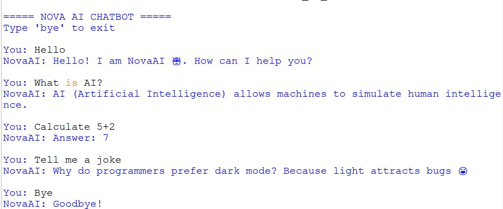

# NovaAI Chatbot

This project is a simple AI chatbot developed using Python.  
It uses basic Natural Language Processing techniques.

## Features
- Greeting responses
- Knowledge based answers
- Calculator
- Time & Date
- Joke generator

## How to Run
Run the Python file using:
python nova_ai_chatbot.py

## 📸 Chatbot Output

